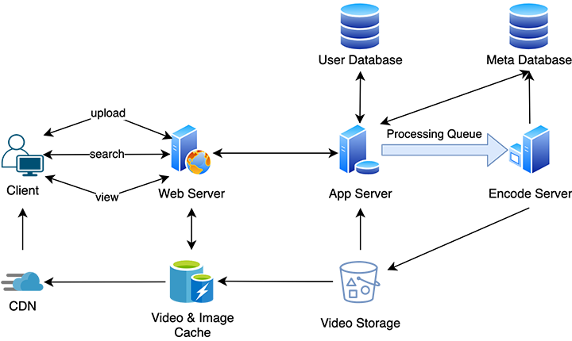

# CiliCili Player
- Proposal of An Online Video Platform
- NYU CS-GY 9223 DevOps

## Overview
- Nowadays, video has penetrated into every aspect of our lives. We can follow videos to learn how to cook, play musical instruments, enjoy the beauty of various countries, learn knowledge, watch the news, and see how other people live across the world. More or less, video has become an indispensable part of our lives.
- Our project is dedicated to building an online video playing platform, including a variety of cutting-edge and popular features like:
  - Highly available online video player
  - Efficient search system
  - User registration, login and authority system
  - User-based recommendation system
  - User reviews and scoring system
  
- The primary purpose of this project is to create an online video viewing system. In addition, we have also thought and reflected on similar products already on the market. 
  - Netflix is a completely B2C video content provider. The video is completely uploaded by the provider and provided to users. Similarly, there are streaming media providers such as HBO Max and Disney+. They lack or essentially do not allow users to upload their own videos. However, in our opinion, users can produce very high-quality videos nowadays. Many vlog bloggers, short film teams, etc. have professional equipment, and they can shoot amazing pictures. They should have a way to directly show their works to other users without the engagement of publishers. 
  - Regarding this problem, YouTube is such a platform that realizes C2C sharing while the B2C function is also complete. However, our team believes that the way user communicate in Youtube are not as efficient and effective as those bullet screen (danmaku, a live commenting system) video sites (such as niconico, JP. and bilibili, CN.). 
  - Correspondingly, these bullet screen video websites do not have strong background transcoding algorithms, distributed content delivery system and online adaptive streaming coding algorithms like YouTube and Netflix. 
  - Based on all points mentioned above, our long-term plan (because one semester is too short, it is difficult for us to fully realize them all) is to combine the advantages of all the above video sites to create an online video playback site that meets the needs of users' actual experience in an ultimate way.

## Assumptions

- We assume that all videos we collect from the Internet are legal and valid
- We assume that some users will actively contribute their experiences and reviews to the system after they watch a video
- We assume that users will not arbitrarily give their ratings and reviews to a video

## Architecture Design

## Technology Stack

### Front-end

- We will use `React.js`, which is a component-based JavaScript library for building user interfaces. See [React.js](https://reactjs.org/) for more details.

### Back-end

- We will use `Flask-Rest X`, which is an extension for Python Flask framework that adds support for quickly building REST APIs. See [Flask-Rest X](https://flask-restx.readthedocs.io/en/latest/) for more details.

### Testing

- For unit test, we will use:
  - `unittest`, to test Python code
  - `Jest`, to test React code

- We will also use linters listed below to enforce code styling:
  - `flake8` for Python
  - `eslint` for React

- Test Cases
  - [Test Cases Sheet (Sheet 1 - Test Case)](https://docs.google.com/spreadsheets/d/1hoKAh89rNywF343tU5lzeamFmidxdYJ39CW_uUCCRLw/edit?usp=sharing)

### API Designs
  - [API Design Sheet (Sheet 2 - API Design)](https://docs.google.com/spreadsheets/d/1hoKAh89rNywF343tU5lzeamFmidxdYJ39CW_uUCCRLw/edit?usp=sharing)

### CI/CD

- We will use `Travis CI`, which provides convenient continuous integration & deployment services.

### Deploy and Monitor

- We will use `Docker` to set up container for our application for cloud deployment and monitoring in the futurue.

## External API integrations and Data Sources

We will use external data from some mainstream online video platforms, including:

- [Netflix](https://www.netflix.com/)
- [Youtube](https://www.youtube.com/)
- [Bilibili](https://www.bilibili.com/)

## Future Works
- We might allow users to upload their own videos.
- We might allow users to delete their own videos.
- We might allow users to post live comment (danmaku).
- We might allow users to block certain users.
- *To Be Continue ...*

## Implementation Plan

- Phase 1, due Sept 22
  - [x] Form a group of 3 (Exceptions can be made if you’d like to form a group of 4 or smaller)
  - [x] Set up a Slack channel for communications within your team
  - [x] Set up a GitHub repository for your project
  - [x] Set up a Kanban board for managing workflow within your team using GitHub “Projects” feature
  - [x] Formulate your project proposal

- Phase 2, due Sept 29
  - [ ] Setup a Flask-RESTX API server
  - [ ] Aim to have, but not limited to, 8 post and get endpoints

- Phase 3, due Oct 6
  - [ ] Create a Makefile to run tests locally, as well as push code into production

- Phase 4, due Oct 20
  - [ ] Keep developing the application
  - [ ] Write tests when writing the code. Tests include unit test and code styling check

- Phase 5, due Nov 3
  - [ ] Set up a CI/CD pipeline using Travis CI. Use it to push your code to PythonAnywhere

- Phase 6, due Nov 17
  - [ ] Create a Docker container for your application. Deploy it to a cloud service. Create monitoring

- Phase 7, due Dec 8
  - [ ] Final project hand in and presentations.
