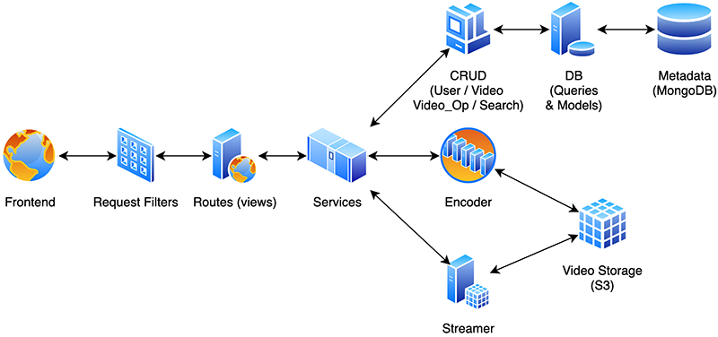

[](https://greloupis-frontend.herokuapp.com/)

# Greloupis Backend

- Tech Stack & Compatibility

    [](https://www.python.org/downloads/release/python-385/)
    [](https://pypi.org/project/Flask/)
    [](https://flask-restx.readthedocs.io/en/latest/)
    [](http://docs.mongoengine.org/projects/flask-mongoengine/en/latest/)
    [](https://flask-cors.readthedocs.io/en/latest/)
    [](https://flask-jwt-extended.readthedocs.io/en/stable/)
    [](https://docs.mongodb.com/manual/release-notes/4.4/)
    [](https://uwsgi-docs.readthedocs.io/en/latest/)
    [](https://flake8.pycqa.org/en/latest/)
    [](https://docs.pytest.org/en/stable/announce/release-6.1.1.html)
    [](https://coverage.readthedocs.io/en/coverage-5.3/)
    [](https://pypi.org/project/codecov/2.1.10/)
    [](https://pypi.org/project/PyYAML/)
    [](https://www.dnspython.org/)

- CI / CD

    <!--[](https://travis-ci.com/HyperTars/Online-Video-Platform)-->
    [](https://github.com/HyperTars/Online-Video-Platform/actions?query=workflow%3ACI%2FCD)
    [](https://codecov.io/gh/HyperTars/Online-Video-Platform)
    [](https://coveralls.io/github/HyperTars/Online-Video-Platform)
    [](https://hub.docker.com/r/hypertars/greloupis-backend)
    [](https://hub.docker.com/r/hypertars/greloupis-backend/tags)
    [](https://hub.docker.com/r/hypertars/greloupis-backend/builds)
    [](https://greloupis-backend.herokuapp.com/)

- Websites and Metrics Monitors
    - [Heroku Backend Site](https://greloupis-backend.herokuapp.com/)
    - [Heroku Backend Metrics Monitor](https://metrics.librato.com/s/public/reo8fj68x)
    - [Docker Backend Repo](https://hub.docker.com/r/hypertars/greloupis-backend/tags)

## Table of Content
- [Setup Guide](#Setup-Guide)
  * [Environment Requirement & Configs](#Environment-Requirement-And-Configs)
  * [Install Dependencies](#Install-Dependencies)
  * [Run Test](#Run-Test)
  * [Run](#Run)
  * [Dockerize](#Dockerize)
  * [Deploy](#Deploy)
- [Features & Designs](#Designs)
  * [Models Design](#Models-Design)
  * [Database Design](#Database-Design)
  * [APIs Design](#APIs-Design)
  * [Components Design](#Components-Design)
  * [Web Server Design](#Web-Server-Design)
  * [Coding Style](#Coding-Style)
- [Tests](#Tests)
- [Contributors](#Contributors)

## Setup Guide

### Environment Requirement And Configs
- **Please make sure the following dependencies are installed and configured before running**
    - Python 3.7 / 3.8 **(3.6 or below and 3.9 are not supported)**
    - Set up [Environment Variable](../documents/env.sh)

- Configurations
    - If you run locally, makefile will set the PROFILE as dev, you can change it in [makefile](makefile)
    - You should configure variables like **MongoDB endpoint**, **AWS endpoint**, loggings, and other settings in [BaseConfig](configs/config_base.py), [DevConfig](configs/config_dev.py), [TestConfig](configs/config_test.py), [ProdConfig](configs/config_prod.py)
        - Note that [TestConfig](configs/config_test.py) is only used for `make tests` and Continuous Integration Test. You'd better create a independent MongoDB Table for it. For developemt use, we recommend you configure [DevConfig](configs/config_dev.py)
        - See how it is related to environment variables [Settings](settings.py)
    - Other settings like [Logging Settings](configs/logging.yml) and [uWSGI Settings](configs/uwsgi.ini)(for docker use)

### Install Dependencies
- To install dependencies, run
```bash
make dev_env_backend
```

### Run Test
- To run test, run
```bash
make tests
```

### Run
- To run backend (SwaggerUI: http://localhost:5000 or http://0.0.0.0:5000)
    - From Docker Hub 
        ```bash
        make docker_hub (including build and run)
        ```
    - From local docker build
        ```bash
        make docker_build docker_run
        ```
    - From uWSGI (use uWSGI to replace flask WSGI)
        ```bash
        make run_wsgi
        ```
    - From native python flask
        ```bash
        make run_python
        ```

### Dockerize
- This section is for you to dockerize manually. Normally, GitHub Action will do the dockerize job once master branch is updated.
- Before dockerize, make sure you've set up [environment variable](../documents/env.sh)
    - PROFILE (you can also change it in [makefile](makefile))
    - BACKEND_BUILD
    - BACKEND_REPO (you can also change it in [makefile](makefile))
- To dockerize backend, run
```bash
make docker_build docker_push
```

### Deploy
- This section is for you to deploy manually. Normally, GitHub Action will do the deploy job once master branch is updated.
- Before deploy, make sure you've set up [environment variable](../documents/env.sh)
    - PROFILE (you can also change it in [makefile](makefile))
    - BACKEND_BUILD
    - BACKEND_REPO (you can also change it in [makefile](makefile))
    - HEROKU_API_KEY
    - HEROKU_APP_NAME
- To deploy to heroku, run
```bash
make heroku
```


## Designs
### Models Design (Entity)
- See full [Models Design](../documents/Models.md)

### Database Design
- See full [Database Design](../documents/Database.md)

### APIs Design
- See full [APIs Design](../documents/APIs.md)
- Or you can access our [backend Swagger UI website](https://greloupis-backend.herokuapp.com/)
    - If you run backend locally and access http://localhost:5000, you will see the same page

### Components Design
1. Processing Queue: Each uploaded video will be pushed to a processing queue to be de-queued later for encoding, thumbnail generation, and storage.
2. Encoder: To encode each uploaded video into multiple formats.
3. Thumbnails generator: To generate a few thumbnails for each video.
4. Video and Thumbnail storage: To store video and thumbnail files in some distributed file storage.
5. User Database: To store user’s information, e.g., name, email, address, etc.
6. Video metadata storage: A metadata database to store all the information about videos like title, file path in the system, uploading user, total views, likes, dislikes, etc. It will also be used to store all the video comments.

- Background Design

    

### Web Server Design
- We use [uWSGI](configs/uwsgi.ini) as our frontend webserver. See how it is configured in [Dockerfile](Dockerfile)

### Coding Style
- Python: [PEP8](https://www.python.org/dev/peps/pep-0008/)

## Tests
- See full [Test Cases](../documents/Test.md)
- Coverage
  - [CodeCov](https://codecov.io/gh/HyperTars/Online-Video-Platform)

## Contributors
  
  GitHub | Name | NetID
  --- | --- | ---
  [HyperTars](https://github.com/HyperTars) | Wenzhou Li | [wl2154](mailto:wl2154@nyu.edu)
  [MikeYan01](https://github.com/MikeYan01) | Linyi Yan | [ly1333](mailto:ly1333@nyu.edu)
  [FatBin](https://github.com/FatBin) | Xuanbin Luo | [xl2806](mailto:xl2806@nyu.edu)
