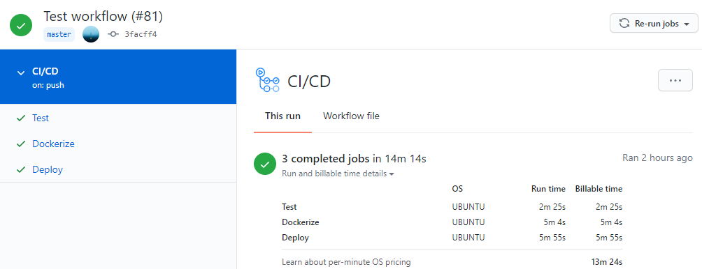
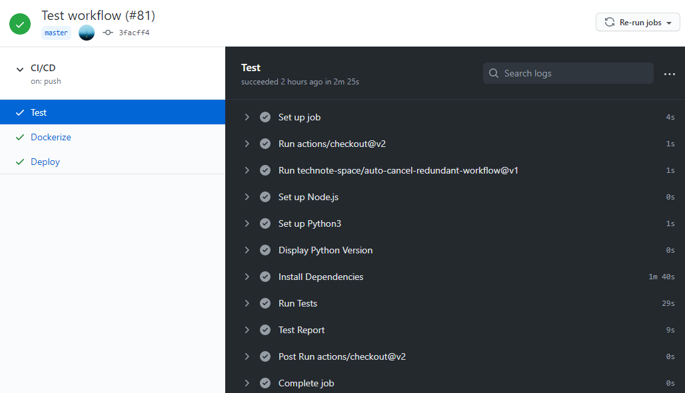
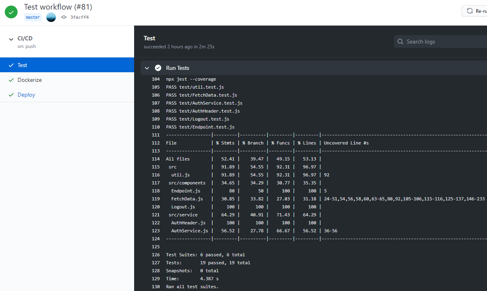
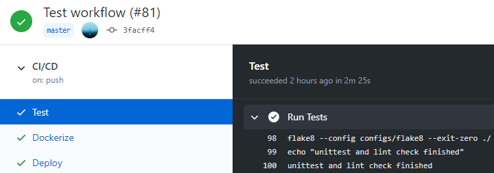
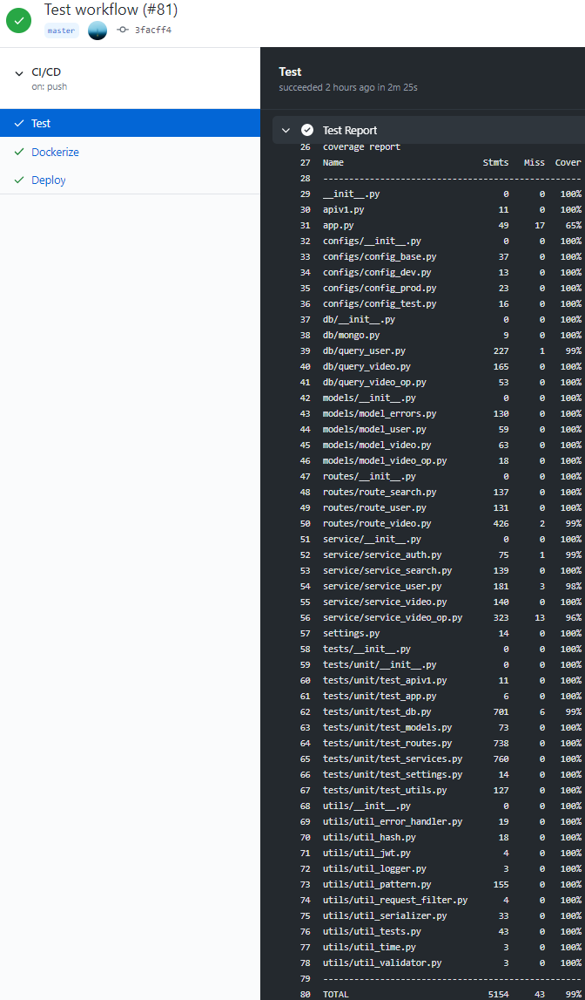
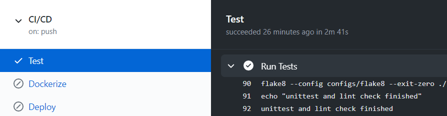
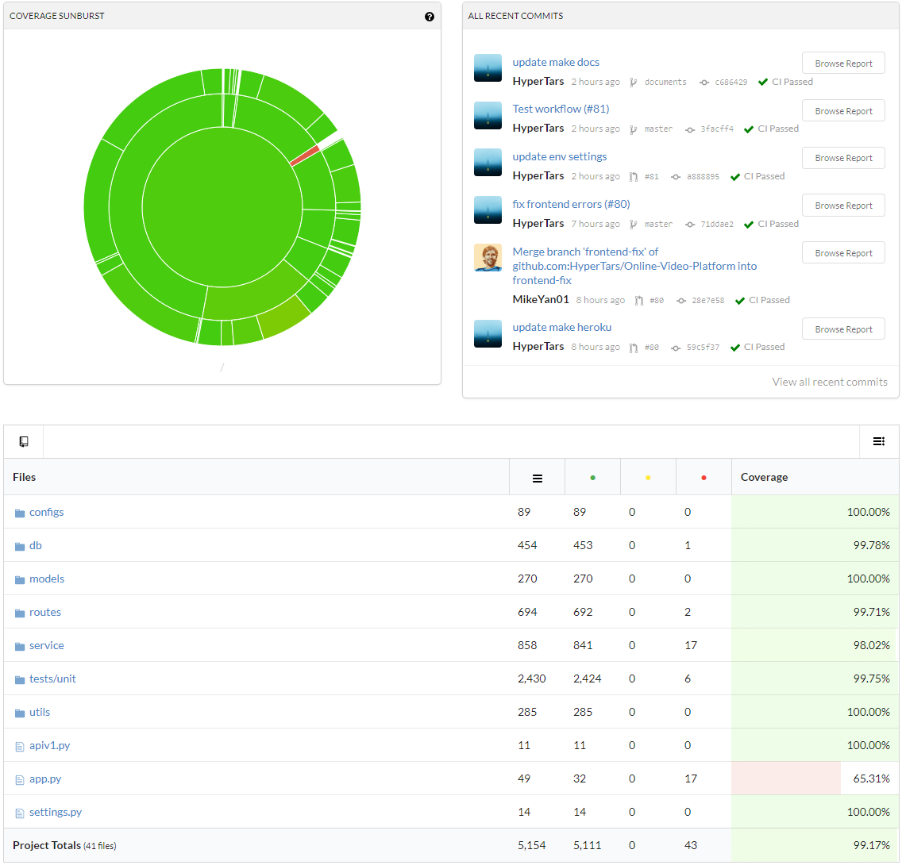
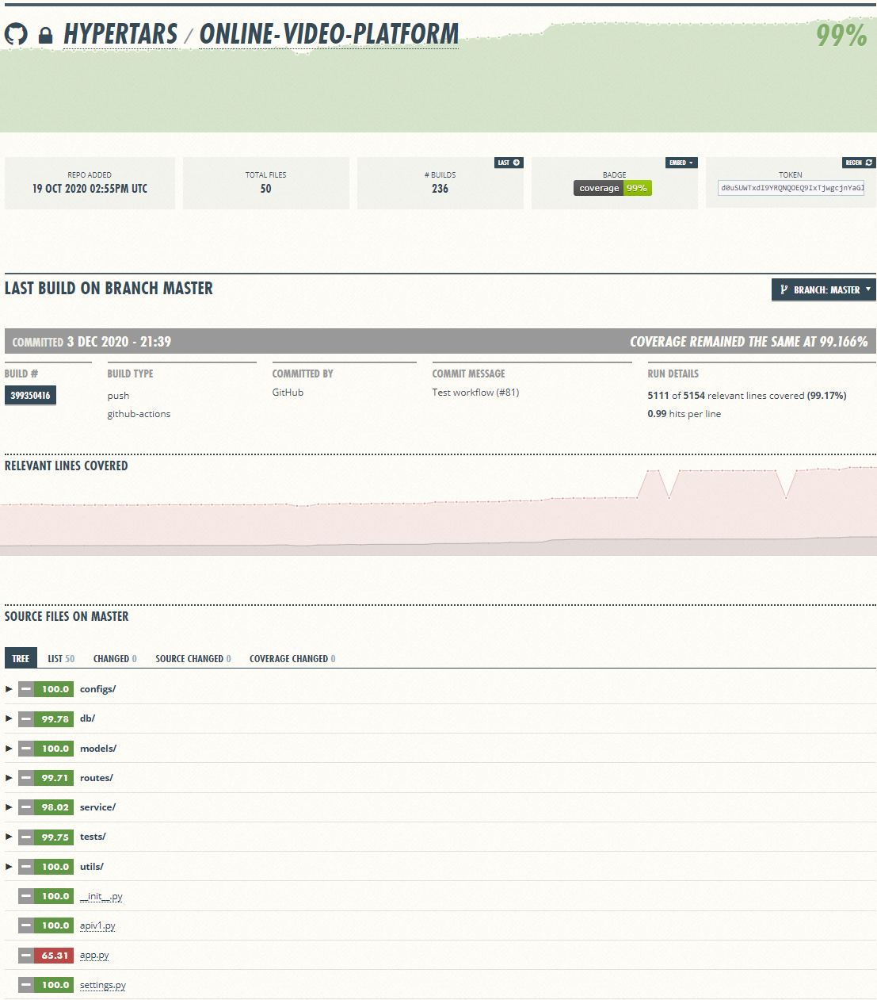
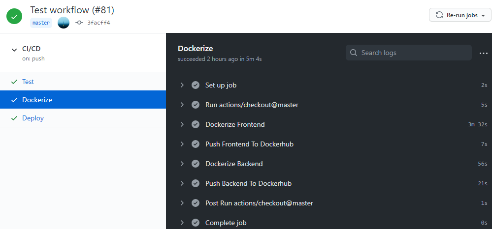
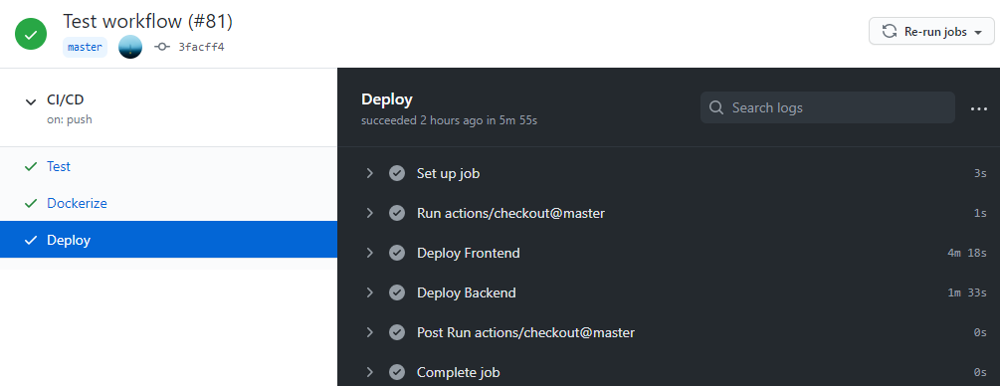

[](https://greloupis-frontend.herokuapp.com/)
# Greloupis - CI / CD Workflow
- Continuous Integration

    [](https://github.com/HyperTars/Online-Video-Platform/actions?query=workflow%3ATest)
    [](https://codecov.io/gh/HyperTars/Online-Video-Platform)
    [](https://coveralls.io/github/HyperTars/Online-Video-Platform)
    
- Continuous Delivery & Deploy (Frontend)

    [](https://hub.docker.com/r/hypertars/greloupis-frontend)
    [](https://hub.docker.com/r/hypertars/greloupis-frontend/tags)
    [](https://hub.docker.com/r/hypertars/greloupis-frontend/builds)
    [](https://greloupis-frontend.herokuapp.com/)

- Continuous Delivery & Deploy (Backend)

    [](https://hub.docker.com/r/hypertars/greloupis-backend)
    [](https://hub.docker.com/r/hypertars/greloupis-backend/tags)
    [](https://hub.docker.com/r/hypertars/greloupis-backend/builds)
    [](https://greloupis-backend.herokuapp.com/)

## Table of Content
- [Greloupis - CI / CD Workflow](#greloupis---ci--cd-workflow)
  - [Table of Content](#table-of-content)
  - [Overview](#overview)
  - [Stage Test](#stage-test)
    - [Setup Test Environment](#setup-test-environment)
    - [Test Frontend](#test-frontend)
    - [Test Backend](#test-backend)
  - [Stage Dockerize](#stage-dockerize)
    - [Dockerize Frontend](#dockerize-frontend)
    - [Dockerize Backend](#dockerize-backend)
    - [Docker-Compose](#docker-compose)
  - [Stage Deploy](#stage-deploy)
    - [Deploy Frontend](#deploy-frontend)
    - [Deploy Backend](#deploy-backend)
    - [Deploy Monintoring](#deploy-monintoring)

## Overview
- We use [GitHub Action](https://github.com/HyperTars/Online-Video-Platform/actions) to do our CI/CD job.
- See our [GitHub Action Configuration](../.github/workflows/cicd.yml)
- We set our running environment as Ubuntu 18.04
- We divide our CI/CD workflow into 3 stages: test, dockerize, and deploy as coded in [GitHub Action Configuration](../.github/workflows/cicd.yml)
    - `Stage Test`: run when any branch is pushed to Github
    - `Stage Dockerize`: run only when `master` branch is pushed to Github
    - `Stage Deploy`: run only when `master` branch is pushed to Github
    - Note that we enabled **branch protection rule for master** so that only **reviewed pull request** can be pushed (merged) into master

    

## Stage Test
- To test our project, you need to setup the environment (node.js & python) and [variables](EnvironmentSettings.md), install dependencies, then run tests and generate test report.
    ```yml
    test:
        name: Test
        runs-on: ubuntu-latest
        if: github.ref == 'refs/heads/master'
        steps:
        - uses: actions/checkout@v2
        - uses: technote-space/auto-cancel-redundant-workflow@v1
        - name: Set up Node.js
        uses: actions/setup-node@v1
        with:
            node-version: 14.15
        - name: Set up Python3 ${{ matrix.python-version }}
        uses: actions/setup-python@v2
        with:
            python-version: 3.8
        - name: Display Python Version
        run: |
            python3 -V
            pip3 -V
        - name: Install Dependencies
        run: make dev_env
        - name: Run Tests
        run: make tests
        - name: Test Report
        run: |
            make report
            make coverage
    ```
    

### Setup Test Environment
- First of all, we setup the environment we need: Node.js 14.15 & Python 3.8 and [variables](EnvironmentSettings.md)
- Then we execute `make_env` to install depenencies
    - In [makefile](../makefile), we execute `dev_env_backend` and `dev_env_frontend`
    - `dev_env_frontend`: open frontend folder and execute [frontend makefile](../frontend/makefile)
        - ```bash
          npm install
          npm run build
          ```
        - [package.json](../frontend/package.json)
    - `dev_env_backend`: open backend folder and execute `dev_env_backend` in [backend makefile](../backend/makefile)
        - ```bash
          pip3 install -r requirements.txt
          ```
        - [requirements.txt](../backend/requirements.txt)

### Test Frontend
- We run `make tests` in [frontend makefile](../frontend/makefile)
    ```makefile
    tests:	test report
    test: 
        npm run test
    report:
        npx jest --coverage
    ```
- `npm run test`: For frontend, we use [jest](../frontend/jest.config.js) to test our React files.
- `report`: After testing, we can generate a test report

    

### Test Backend
- We run `make tests` in [backend makefile](../backend/makefile)
    ```makefile
    tests:	unit report lint
        echo "unittest and lint check finished"
    unit:
        coverage run --source ./ -m py.test --disable-pytest-warnings
    lint:
        $(LINTER) --config configs/flake8 --exit-zero ./
    report:
        coverage report
    coverage:
        - coveralls
        - codecov -t $(CODECOV_TOKEN)
    ```
- `unit`: In unit test part, we use `PyTest` to test every file we wrote for background separately with lots of boundary cases. Since lots of tests need to interact with MongoDB, this might take some time (usually 20 sec ~ 60 sec)

    
- `report`: Then we generate a coverage report for each file. Since some try-exception boundary cases cannot be reached, coverage of some files will be close to 100% but not exactly 100%.

    
- `lint`: Finally, we use [Flake8](../backend/configs/flake8) to do lint test

    
- Finally, we upload our test results to [CodeCov](https://codecov.io/gh/HyperTars/Online-Video-Platform) and [Coveralls](https://coveralls.io/github/HyperTars/Online-Video-Platform) so that we can see our visualized coverage report.
    - CodeCov

        
    - Coveralls

        

## Stage Dockerize
- To dockerize our project, we wrote Dockerfile for both [frontend](../frontend/Dockerfile) and [backend](../backend/Dockerfile). And we also have a [docker-compose](../docker-compose.yml) in case you want to run both frontend and backend locally with only one command in one terminal.
    ```yml
    dockerize:
        name: Dockerize
        runs-on: ubuntu-18.04
        needs: [test]
        if: github.ref == 'refs/heads/master'
        steps:
        - uses: actions/checkout@master
        - name: Dockerize Frontend
            run: make docker_build_frontend
        - name: Push Frontend To Dockerhub
            run: make docker_push_frontend
        - name: Dockerize Backend
            run: make docker_build_backend
        - name: Push Backend To Dockerhub
            run: make docker_push_backend
    ```
    


### Dockerize Frontend
- We run `make docker_build docker_push` in [frontend makefile](../frontend/makefile)
    ```makefile
    docker_build:
	- docker build --build-arg ACCESS_KEY_ID1=$(ACCESS_KEY_ID1) --build-arg ACCESS_KEY_ID2=$(ACCESS_KEY_ID2) --build-arg SECRET_KEY1=$(SECRET_KEY1) --build-arg SECRET_KEY2=$(SECRET_KEY2) -f Dockerfile -t $(FRONTEND_BUILD):$(TAG) .
    docker_push:
        - docker login --username $(DOCKER_USER) --password $(DOCKER_PASS)
        - docker tag $(FRONTEND_BUILD) $(FRONTEND_REPO)
        - docker push $(FRONTEND_REPO)
    docker_run:	docker_run_nginx
    docker_run_nginx:
        - docker run -p 3000:3000 --env PORT=3000 --rm -it -v /app/node_modules -e CHOKIDAR_USEPOLLING=true $(FRONTEND_BUILD)
    docker_hub:
        - docker run -p 3000:3000 --env PORT=3000 --rm -it $(FRONTEND_REPO):$(TAG)
    ```
- We set up instructions for building, running [Dockerfile](../frontend/Dockerfile) and pushing to, retrieving and running from [Dockerhub](https://hub.docker.com/r/hypertars/greloupis-frontend)
- We use `--env` to bind the 3000 port in case running locally, which will be decided automatically in [heroku](https://greloupis-frontend.herokuapp.com)
- Note that if you want to tag and push locally, you should configure the [environment variables](EnvironmentSettings.md) first. [These](../environ.sh) should also be set in **GitHub Action Secret Keys** so that the workflow could be executed automatically.
- You can set `$(TAG)` in environment if you wish, the default value is `latest`
- Run `make docker_run_frontend` to use [Dockerfile](../frontend/Dockerfile) to run frontend locally.

### Dockerize Backend
- We run `make docker_build docker_push` in [backend makefile](../backend/makefile)
    ```makefile
    docker_build:
        - docker build -f Dockerfile -t $(BACKEND_BUILD):$(TAG) .
    docker_run:
        - docker run -p 5000:5000 --env PORT=5000 --env AWS_AUTH_KEY=$(AWS_AUTH_KEY) --env PROFILE=$(PROFILE) $(BACKEND_BUILD)
    docker_push:
        - docker login --username $(DOCKER_USER) --password $(DOCKER_PASS)
        - docker tag $(BACKEND_BUILD) $(BACKEND_REPO)
        - docker push $(BACKEND_REPO)
    docker_hub:
        - docker run -p 5000:5000 --env PORT=5000 --env AWS_AUTH_KEY=$(AWS_AUTH_KEY) --env PROFILE=$(PROFILE) --rm -it $(BACKEND_REPO):$(TAG)
    ```
- We set up instructions for building, running [Dockerfile](../backend/Dockerfile) and pushing to, retrieving and running from [Dockerhub](https://hub.docker.com/r/hypertars/greloupis-backend)
- We use `--env` to bind the 5000 port in case running locally, which will be decided automatically in [heroku](https://greloupis-frontend.herokuapp.com)
- Note that if you want to tag and push locally, you should configure the [environment variables](EnvironmentSettings.md) first. [These](../environ.sh) should also be set in **GitHub Action Secret Keys** so that the workflow could be executed automatically.
- You can set `$(TAG)` in environment if you wish, the default value is `latest`
- Run `make docker_run_backend` to use [Dockerfile](../backend/Dockerfile) to run backend locally.

### Docker-Compose
- *For running test locally only*
- We also wrote a docker-compose file so that you can run both frontend and backend locally with one command in one terminal.
    ```yml
    version: "3"
    services:
    frontend:
        container_name: frontend
        build:
        context: ./frontend
        dockerfile: Dockerfile
        args:
            - ACCESS_KEY_ID1=${ACCESS_KEY_ID1}
            - SECRET_KEY1=${SECRET_KEY1}
            - ACCESS_KEY_ID2=${ACCESS_KEY_ID2}
            - SECRET_KEY2=${SECRET_KEY2}
        ports:
        - 80:80
        - 443:443
        - 3000:3000
        volumes:
        - ./frontend:/usr/src/app
        - ./frontend/configs/nginx.template:/etc/nginx/conf.d/default.conf.template
        - ./frontend/configs/nginx.conf:/etc/nginx/nginx/conf
        environment:
        - PORT=3000
        image: hypertars/greloupis-frontend:latest

    backend:
        restart: always
        container_name: backend
        build:
        context: ./backend
        dockerfile: Dockerfile
        ports:
        - 5000:5000
        volumes:
        - ./backend:/usr/src/app
        environment:
        - PORT=5000
        - PROFILE="prod"
        - AWS_AUTH_KEY=${AWS_AUTH_KEY}
        image: hypertars/greloupis-backend:latest
    ```

- Like Dockerfile we mentioned before, we bind ports 3000 and 5000 manually so that you access frontend through http://localhost:3000 and backend through http://localhost:5000.
- Run `make docker_run` to use [docker-compose](../docker-compose.yml) to run both frontend and backend locally.

## Stage Deploy
- We use **Heroku** to deploy our [Frontend Site](https://greloupis-frontend.herokuapp.com/) and [Backend Site](https://greloupis-backend.herokuapp.com/)
    ```yml
    deploy:
        name: Deploy
        runs-on: ubuntu-18.04
        needs: [dockerize]
        if: github.ref == 'refs/heads/master'
        steps:
        - uses: actions/checkout@master
        - name: Deploy Frontend
            run: make heroku_frontend
        - name: Deploy Backend
            run: make heroku_backend
    ```
    


### Deploy Frontend
- We run `make heroku` in [frontend makefile](../frontend/makefile)
    ```makefile
    heroku:
        - docker login --username _ --password=$(HEROKU_API_KEY) registry.heroku.com
        - heroku container:push web --arg ACCESS_KEY_ID1=$(ACCESS_KEY_ID1),ACCESS_KEY_ID2=$(ACCESS_KEY_ID2),SECRET_KEY1=$(SECRET_KEY1),SECRET_KEY2=$(SECRET_KEY2) --app $(FRONTEND_BUILD)
        - heroku container:release web --app $(HEROKU_APP_FRONTEND)
    ```
- We use `--arg` to set up **Dockerfile building environment variables**
- Note that if you want to tag and push locally, you should configure the [environment variables](EnvironmentSettings.md) first. [These](../environ.sh) should also be set in **GitHub Action Secret Keys** so that the workflow could be executed automatically.

### Deploy Backend
- We run `make heroku` in [backend makefile](../backend/makefile)
    ```makefile
    heroku:
        - docker login --username _ --password=$(HEROKU_API_KEY) registry.heroku.com
        - heroku container:push web --app $(BACKEND_BUILD)
        - heroku container:release web --app $(BACKEND_BUILD)
    ```
- Note that if you want to tag and push locally, you should configure the [environment variables](EnvironmentSettings.md) first. [These](../environ.sh) should also be set in **GitHub Action Secret Keys** so that the workflow could be executed automatically.

### Deploy Monintoring
- [Heroku Frontend Metrics Monitor](https://metrics.librato.com/s/public/wxet4vyas)
- [Heroku Backend Metrics Monitor](https://metrics.librato.com/s/public/reo8fj68x)