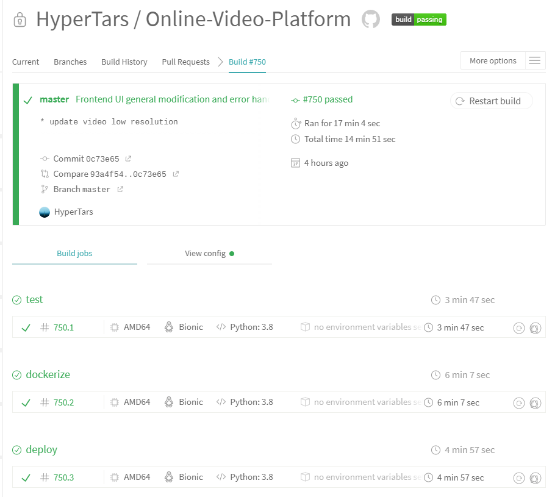
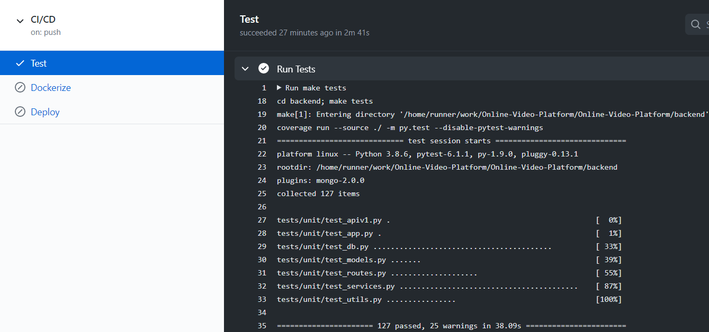
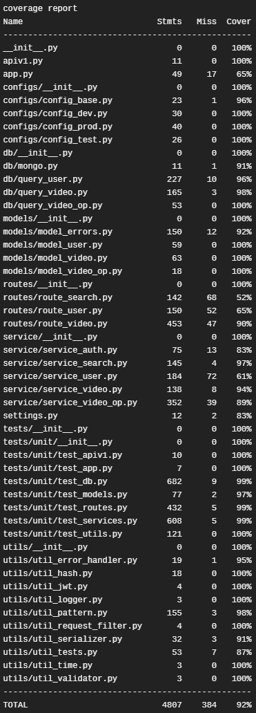
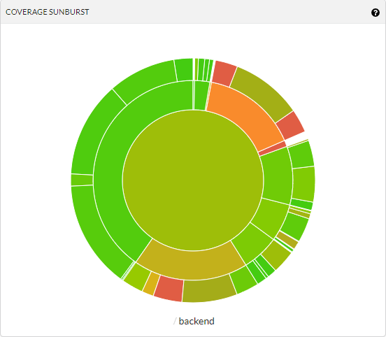
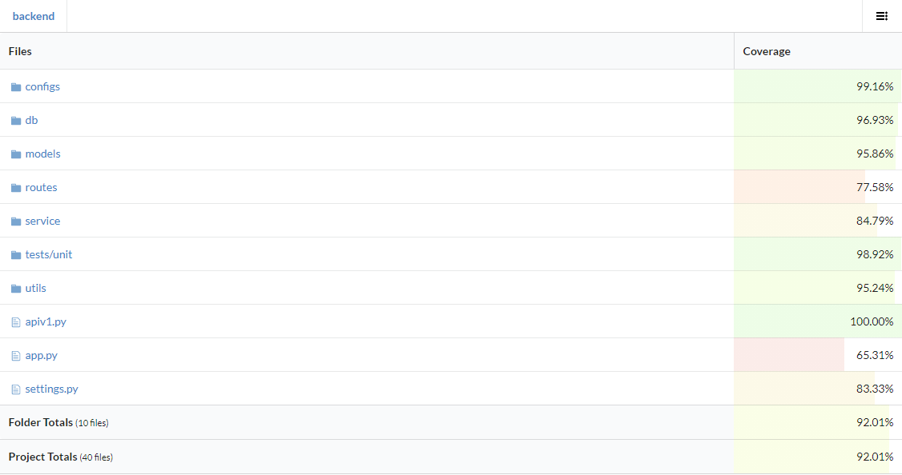

[](https://greloupis-frontend.herokuapp.com/)
# Greloupis - CI / CD Workflow
- Continuous Integration

    [](https://travis-ci.com/HyperTars/Online-Video-Platform)
    [](https://codecov.io/gh/HyperTars/Online-Video-Platform)
    <!-- [](https://coveralls.io/github/HyperTars/Online-Video-Platform) -->
    
- Continuous Delivery & Deploy (Frontend)

    [](https://hub.docker.com/r/hypertars/greloupis-frontend)
    [](https://hub.docker.com/r/hypertars/greloupis-frontend/tags)
    [](https://hub.docker.com/r/hypertars/greloupis-frontend/builds)
    [](https://greloupis-frontend.herokuapp.com/)

- Continuous Delivery & Deploy (Backend)

    [](https://hub.docker.com/r/hypertars/greloupis-backend)
    [](https://hub.docker.com/r/hypertars/greloupis-backend/tags)
    [](https://hub.docker.com/r/hypertars/greloupis-backend/builds)
    [](https://greloupis-backend.herokuapp.com/)

## Table of Content
- [What we use](#What-we-use)
- [How we do](#How-we-do)
  * [Overview](#Overview)
  * [Continuous Integration: Stage Test](#Stage-Test)
  * [Continuous Delivery: Stage Dockerize](#Stage-Dockerize)
  * [Continuous Deploy: Stage Deploy](#Stage-Deploy)

## What we use
- We use [Travis-CI](https://travis-ci.com/github/HyperTars/Online-Video-Platform) to do our CI/CD job.
- See our [Travis Configuration](../.travis.yml)
- We set our running environment as Ubuntu Bionic

## How we do
### Overview
- We divide our CI/CD workflow into 3 stages: test, dockerize, and deploy as coded in [Travis Configuration](../.travis.yml)
    - `Stage Test`: run when any branch is pushed to Github
    - `Stage Dockerize`: run only when `master` branch is pushed to Github
    - `Stage Deploy`: run only when `master` branch is pushed to Github
    - Note that we enabled **branch protection rule for master** so that only **reviewed pull request** can be pushed (merged) into master
    ```yml
    stages:
    - test
    - name: dockerize
        if: branch = master AND type = push AND fork = false
    - name: deploy
        if: branch = master AND type = push AND fork = false
    ```

    

### Stage Test
```yml
- stage: test
  install: skip
  script:
    - curl -o- https://raw.githubusercontent.com/nvm-sh/nvm/v0.36.0/install.sh | bash
    - nvm install 14.15.0
    - nvm use 14.15.0
    - make dev_env
    - make tests
```
- First of all, we install nvm version we need
- Then we execute `make_env` to install depenencies
    - In [makefile](../makefile), we execute `dev_env_backend` and `dev_env_frontend`
    - `dev_env_frontend`: open frontend folder and execute [frontend makefile](../frontend/makefile)
        - ```bash
          npm -g install react-scripts
          npm install
          npm run build
          ```
        - [package.json](../frontend/package.json)
    - `dev_env_backend`: open backend folder and execute `dev_env_backend` in [backend makefile](../backend/makefile)
        - ```bash
          pip3 install -r requirements.txt
          ```
        - [requirements.txt](../backend/requirements.txt)
- After all the dependencies are installed, we can run `tests`
    - Frontend
        - `npm run test`: For frontend, we use [jest](../frontend/jest.config.js) to test our React files.
        - `report`: After testing, we can generate a test report

            
    - Backend
        - `unit`: In unit test part, we use `PyTest` to test every file we wrote for background separately with lots of boundary cases. Since lots of tests need to interact with MongoDB, this might take some time (usually 20 sec ~ 60 sec)

            
        - `report`: Then we generate a coverage report for each file. Since some try-exception boundary cases cannot be reached, coverage for each file is usually less than 100%

            
        - `lint`: Finally, we use [Flake8](../backend/configs/flake8) to do lint test
- Finally, we upload our test results to [CodeCov](https://codecov.io/gh/HyperTars/Online-Video-Platform) so that we can see our visualized coverage report.

    
    

### Stage Dockerize
```yml
- stage: dockerize
  install: skip
  script:
    - make docker_push
```
- To dockerize our project, we wrote Dockerfile for both [frontend](../frontend/Dockerfile) and [backend](../backend/Dockerfile). And we also have a [docker-compose](../docker-compose.yml) in case you want to run both frontend and backend locally with only one command in one terminal.
- **Frontend**
    ```makefile
    docker_build:
	- docker build -f Dockerfile -t $(FRONTEND_BUILD):$(TAG) .

    docker_push:
        - docker login --username $(DOCKER_USER) --password $(DOCKER_PASS)
        - docker tag $(FRONTEND_BUILD) $(FRONTEND_REPO)
        - docker push $(FRONTEND_REPO)

    docker_run:	docker_run_nginx

    docker_run_nginx:
        - docker run -p 3000:3000 --env PORT=3000 --rm -it -v /app/node_modules -e CHOKIDAR_USEPOLLING=true $(FRONTEND_BUILD)

    docker_hub:
        - docker run -p 3000:3000 --env PORT=3000 --rm -it $(FRONTEND_REPO):$(TAG)
    ```
    - We set up instructions for building, running [Dockerfile](../frontend/Dockerfile) and pushing to, retrieving and running from [Dockerhub](https://hub.docker.com/r/hypertars/greloupis-frontend)
    - We use `--env` to bind the 3000 port in case running locally, which will be decided automatically in [heroku](https://greloupis-frontend.herokuapp.com)
    - Note that if you want to tag and push locally, you should configure the [environment variables](env.sh) first. These should also be set in Travis-CI so that the workflow could be executed automatically.
    - You can set `$(TAG)` in environment if you wish, the default value is `latest`
    - Run `make docker_run_frontend` to use [Dockerfile](../frontend/Dockerfile) to run frontend locally.
- **Backend**
    ```makefile
    docker_build:
	- docker build -f Dockerfile -t $(BACKEND_BUILD):$(TAG) .

    docker_run:
        - docker run -p 5000:5000 --env PORT=5000 --env PROFILE=$(PROFILE) $(BACKEND_BUILD)

    docker_push:
        - docker login --username $(DOCKER_USER) --password $(DOCKER_PASS)
        - docker tag $(BACKEND_BUILD) $(BACKEND_REPO)
        - docker push $(BACKEND_REPO)

    docker_hub:
        - docker run -p 5000:5000 --env PORT=5000 --rm -it $(BACKEND_REPO):$(TAG)
    ```
    - We set up instructions for building, running [Dockerfile](../backend/Dockerfile) and pushing to, retrieving and running from [Dockerhub](https://hub.docker.com/r/hypertars/greloupis-backend)
    - We use `--env` to bind the 5000 port in case running locally, which will be decided automatically in [heroku](https://greloupis-frontend.herokuapp.com)
    - Note that if you want to tag and push locally, you should configure the [environment variables](env.sh) first. These should also be set in Travis-CI so that the workflow could be executed automatically.
    - You can set `$(TAG)` in environment if you wish, the default value is `latest`
    - Run `make docker_run_backend` to use [Dockerfile](../backend/Dockerfile) to run backend locally.
- **Docker-Compose** (For running test locally only)
    ```yml
    version: "3"
    services:
    frontend:
        container_name: frontend
        build:
        context: ./frontend
        dockerfile: Dockerfile
        ports:
        - 80:80
        - 443:443
        - 3000:3000
        volumes:
        - ./frontend:/usr/src/app
        - ./frontend/configs/nginx.template:/etc/nginx/conf.d/default.conf.template
        - ./frontend/configs/nginx.conf:/etc/nginx/nginx/conf
        environment:
        - PORT=3000
        image: hypertars/greloupis-frontend:latest

    backend:
        restart: always
        container_name: backend
        build:
        context: ./backend
        dockerfile: Dockerfile
        ports:
        - 5000:5000
        volumes:
        - ./backend:/usr/src/app
        environment:
        - PORT=5000
        - PROFILE=prod
        image: hypertars/greloupis-backend:latest
    ```
    - We also wrote a docker-compose file so that you can run both frontend and backend locally with one command in one terminal.
    - Like Dockerfile we mentioned before, we bind ports 3000 and 5000 manually so that you access frontend through http://localhost:3000 and backend through http://localhost:5000.
    - Run `make docker_run` to use [docker-compose](../docker-compose.yml) to run both frontend and backend locally.
### Continuous Deploy: Stage Deploy
```yml
- stage: deploy
  install: skip
  script:
    - make heroku
```
- We use **Heroku** to deploy our [Frontend Site](https://greloupis-frontend.herokuapp.com/) and [Backend Site](https://greloupis-backend.herokuapp.com/)
- **Frontend**
    - [make heroku](../frontend/makefile)
    ```makefile
    heroku:
        - docker login --username _ --password=$(HEROKU_API_KEY) registry.heroku.com
        - heroku container:push web --app $(FRONTEND_BUILD)
        - heroku container:release web --app $(FRONTEND_BUILD)
    ```
    - Note that if you want to push to heroku from local, you should configure the [environment variables](env.sh) first. These should also be set in Travis-CI so that the workflow could be executed automatically.
- **Backend**
    - [make heroku](../backend/makefile)
    ```makefile
    heroku:
        - docker login --username _ --password=$(HEROKU_API_KEY) registry.heroku.com
        - heroku container:push web --app $(BACKEND_BUILD)
        - heroku container:release web --app $(BACKEND_BUILD)
    ```
    - Note that if you want to push to heroku from local, you should configure the [environment variables](env.sh) first. These should also be set in Travis-CI so that the workflow could be executed automatically.
- **Monintoring**
    - [Heroku Frontend Metrics Monitor](https://metrics.librato.com/s/public/wxet4vyas)
    - [Heroku Backend Metrics Monitor](https://metrics.librato.com/s/public/reo8fj68x)