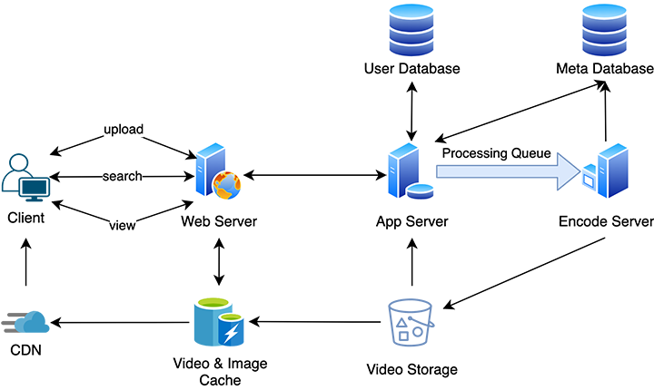

[](https://greloupis-frontend.herokuapp.com/)

# Greloupis - An online video sharing platform

- Main Tech Stack & Compatibility

    [](https://www.python.org/downloads/release/python-385/)
    [](https://blog.npmjs.org/post/626732790304686080/release-6148)
    [](https://nodejs.org/dist/latest-v14.x/docs/api/)
    [](https://pypi.org/project/Flask/)
    [](https://reactjs.org/versions)
    [](https://docs.mongodb.com/manual/release-notes/4.4/)

- Continuous Integration

    <!--[](https://travis-ci.com/HyperTars/Online-Video-Platform)-->
    [](https://github.com/HyperTars/Online-Video-Platform/actions?query=workflow%3ACI%2FCD)
    [](https://codecov.io/gh/HyperTars/Online-Video-Platform)
    [](https://coveralls.io/github/HyperTars/Online-Video-Platform)
    
- Continuous Delivery & Deploy (Frontend)

    [](https://hub.docker.com/r/hypertars/greloupis-frontend)
    [](https://hub.docker.com/r/hypertars/greloupis-frontend/tags)
    [](https://hub.docker.com/r/hypertars/greloupis-frontend/builds)
    [](https://greloupis-frontend.herokuapp.com/)

- Continuous Delivery & Deploy (Backend)

    [](https://hub.docker.com/r/hypertars/greloupis-backend)
    [](https://hub.docker.com/r/hypertars/greloupis-backend/tags)
    [](https://hub.docker.com/r/hypertars/greloupis-backend/builds)
    [](https://greloupis-backend.herokuapp.com/)

<!-- [](https://github.com/facebook/jest) -->
<!-- [](https://github.com/prettier/prettier) -->
<!-- [](https://github.com/HyperTars/Online-Video-Platform/stargazers) -->
<!-- [](https://github.com/HyperTars/Online-Video-Platform/commits/master) -->
<!-- [](https://github.com/HyperTars/Online-Video-Platform/commits/master) -->

- Websites and Metrics Monitors
    - Our [Heroku Frontend Site](https://greloupis-frontend.herokuapp.com/) | [Heroku Backend Site](https://greloupis-backend.herokuapp.com/)
    - Our [Heroku Frontend Metrics Monitor](https://metrics.librato.com/s/public/wxet4vyas) | [Heroku Backend Metrics Monitor](https://metrics.librato.com/s/public/reo8fj68x)

## Table of Content
- [Greloupis - An online video sharing platform](#greloupis---an-online-video-sharing-platform)
  - [Table of Content](#table-of-content)
  - [Documents](#documents)
    - [Project Proposal](#project-proposal)
    - [Frontend Details](#frontend-details)
    - [Backend Details](#backend-details)
    - [CI / CD Workflow](#ci--cd-workflow)
    - [Environment Settings](#Environment-Settings)
  - [Setup Guide](#setup-guide)
      - [Environment Requirement](#environment-requirement)
      - [Install Dependencies](#install-dependencies)
      - [Run Test](#run-test)
      - [Make Prod](#make-prod)
      - [Run](#run)
  - [Designs](#designs)
    - [Coding Style](#coding-style)
    - [APIs Design](#apis-design)
    - [Components Design](#components-design)
  - [CI CD](#ci-cd)
  - [Contributors](#contributors)

## Documents
### [Project Proposal](documents/Proposal.md)
### [Frontend Details](frontend/readme.md)
### [Backend Details](backend/readme.md)
### [CI / CD Workflow](documents/cicd.md)
### [Environment Settings](documents/EnvironmentSettings.md)

## Setup Guide

#### Environment Requirement
- Python 3.7 / 3.8 **(3.6 or below and 3.9 are not supported)**
- npm (6.14.8)
- node.js (14.15.0)
- [Environment Variables](documents/EnvironmentSettings.md)
- Make sure MongoDB & AWS Endpoints are all set, see more details in [Backend Setup Guide](backend/readme.md#Environment-Requirement-And-Configs)
#### Install Dependencies
- To install dependencies, run
```bash
make dev_env
```

#### Run Test
- To run test, run
```bash
make tests
```

#### Make Prod
- To make prod, run
```bash
make prod
```

#### Run
- To run both frontend(http://localhost:3000) and backend (http://localhost:5000) locally
    - Start (build from [docker-compose.yml](docker-compose.yml))
        ```bash
        make docker_build
        ```
    - Run
        ```bash
        make docker_run
        ```
- Or you can access our [website deployed on Heroku](https://greloupis-frontend.herokuapp.com/)
- To test our project, you can try to register or log in with existed user for testing
    - For existed users, you can [search their username](https://greloupis-frontend.herokuapp.com/search?keyword=)
    - User accounts for testing
        - Username: hypertars, Password: hypertars
        - Username: milvus, Password: milvus
        - Username: eclipse, Password: eclipse

## Designs
### Coding Style
- Python: [PEP8](https://www.python.org/dev/peps/pep-0008/)
- React: [JSX](https://reactjs.org/docs/introducing-jsx.html)

### APIs Design
- See full [APIs Design](documents/APIs.md)
- Or you can access our [backend Swagger UI website](https://greloupis-backend.herokuapp.com/)

### Components Design
1. Processing Queue: Each uploaded video will be pushed to a processing queue to be de-queued later for encoding, thumbnail generation, and storage.
2. Encoder: To encode each uploaded video into multiple formats.
3. Thumbnails generator: To generate a few thumbnails for each video.
4. Video and Thumbnail storage: To store video and thumbnail files in some distributed file storage.
5. User Database: To store user’s information, e.g., name, email, address, etc.
6. Video metadata storage: A metadata database to store all the information about videos like title, file path in the system, uploading user, total views, likes, dislikes, etc. It will also be used to store all the video comments.

- Architecture Design
    
    

## CI CD
- We use `GitHub Action`, `Docker` and `Heroku` to do CI/CD works
  - Full [Test Cases](documents/Test.md)
  - Coverage (test results) [CodeCov](https://codecov.io/gh/HyperTars/Online-Video-Platform) | [Coverall](https://coveralls.io/github/HyperTars/Online-Video-Platform)
  - [GitHub Action Conf](.github/workflows/cicd.yml) | [Github Action Status](https://github.com/HyperTars/Online-Video-Platform/actions?query=workflow%3ACI%2FCD)
  - [Docker Conf](docker-compose.yml) | [Docker Frontend Repo](https://hub.docker.com/r/hypertars/greloupis-frontend/tags) | [Docker Backend Repo](https://hub.docker.com/r/hypertars/greloupis-backend/tags)
  - [Heroku Frontend](https://greloupis-frontend.herokuapp.com/) | [Heroku Backend](https://greloupis-backend.herokuapp.com/)
  - [Heroku Frontend Metrics Monitor](https://metrics.librato.com/s/public/wxet4vyas) | [Heroku Backend Metrics Monitor](https://metrics.librato.com/s/public/reo8fj68x)
- See more details about our [CI / CD Workflow](documents/cicd.md)

## Contributors
  
  GitHub | Name | NetID
  --- | --- | ---
  [HyperTars](https://github.com/HyperTars) | Wenzhou Li | [wl2154](mailto:wl2154@nyu.edu)
  [MikeYan01](https://github.com/MikeYan01) | Linyi Yan | [ly1333](mailto:ly1333@nyu.edu)
  [FatBin](https://github.com/FatBin) | Xuanbin Luo | [xl2806](mailto:xl2806@nyu.edu)
